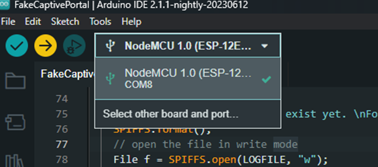
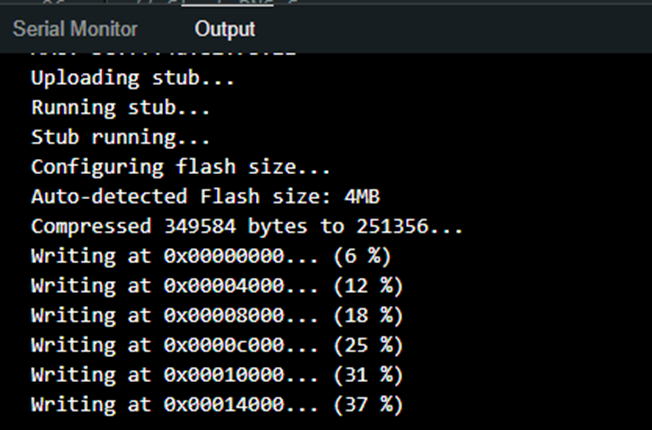
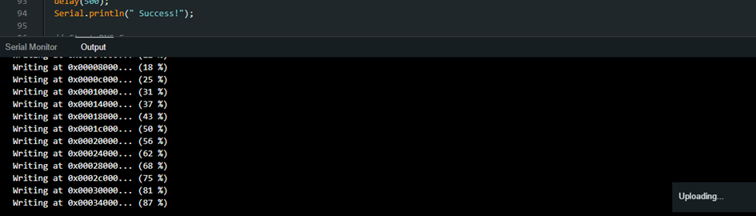
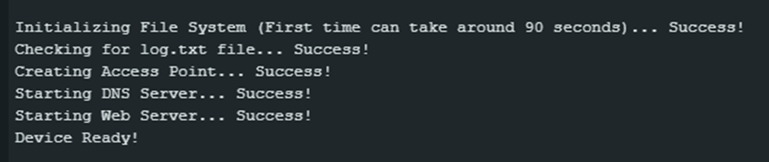
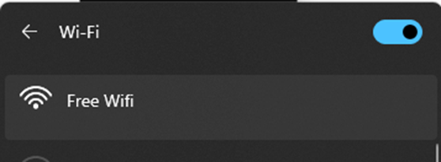
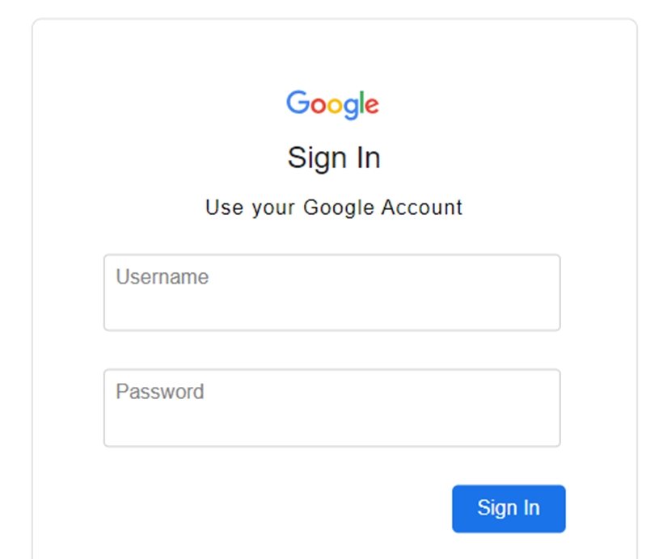
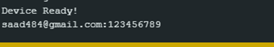

# ESP8266 Fake Captive Portal

## Disclaimer

**Attention: The misuse of this software for unauthorized activities can result in criminal consequences. The author(s) will not be held responsible for any illegal or unethical use of this software. Use it responsibly and only in compliance with applicable laws and regulations.**

## Overview

This project implements a rogue captive portal attack device using the ESP8266 platform. The captive portal intercepts DNS look-ups and presents login interfaces for specific URLs such as Google, Facebook, and Yahoo. Captured login credentials are stored in the ESP8266 flash memory and can be accessed by visiting `RandomDomain.com/logs`.

## Features

- **Captive Portal:** Intercepts DNS look-ups and presents fake login interfaces for specified URLs.
- **Login Interfaces:** Currently implements Google, Facebook, and Yahoo login masks, with the Google sign-in template as the default.
- **Credential Harvesting:** Captured login data is stored in the ESP8266 flash memory.
- **LED Indicators:** The built-in LED blinks to confirm successful start-up (10 blinks) and when a user logs in (5 blinks).

## Usage

### Setting Up the Board
1. Select the board type as NodeMCU 1.0 (ESP-12E).

2. Export the code to the ESP8266.

3. After the export, verify that the process is successful in the terminal.

4. Connect to the WiFi.

5. You should be redirected to a Gmail login page.

6. View captured information in the terminal after clicking "Sign In."

### Hardware Requirements

- An ESP8266-compatible board.
- Correct SPIFFS setup.
- LED pin configuration.

### Installation

1. Install the sketch using the Arduino IDE on an ESP8266-compatible board.
2. Set up SPIFFS and configure the LED pin.
3. No additional hardware is needed.

### Configuration

- Update the WiFi public SSID and captive portal page in the main file.

### Optional Setup

- Set up a catch-all captive portal and specify three websites to simulate for credential harvesting.

### Powering the Device

- The device can be powered by a power bank for portability.

## Viewing Captured Credentials

- Captured login credentials can be viewed by visiting `RandomDomain.com/logs`.

